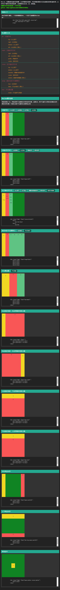

# flex.css
====

### 简介
```
flex.css，轻量级移动端布局神器，
让你用最快的速度，
并且用最优雅的方式完成复杂的移动端布局，
让你专注于编写内容呈现效果，
完美兼容Android，ios，微信端
```

### 兼容性
```
flex布局分为旧版本dispaly: box;，过渡版本dispaly: flexbox;，以及现在的标准版本display: flex;
Android 
  2.1 开始就支持旧版本 display:-webkit-box;
  4.4 开始支持标准版本 display: flex;
  
IOS 
  6.0 开始支持旧版本 display:-webkit-box;
  7.0 开始支持标准版本 display: flex;

flex.css同时能兼容新版本和旧版本，保证了浏览器不支持新版本时，回退到旧版本。
```  

### 使用
```html
<!--
  可以根据自己的需要，使用不同的属性版本来进行匹配布局
  flex.min.css 使用flex属性匹配
  data-flex.min.css 使用data-flex属性匹配（React使用）
 -->
<!-- flex属性匹配，简单的子元素居中例子： -->
  <div flex="main:center cross:center" style="width:500px; height: 500px; background: #108423">
    <div style="background: #fff">看看我是不是居中的</div>
  </div>
  
<!-- data-flex属性匹配，简单的子元素居中例子： -->
  <div data-flex="main:center cross:center" style="width:500px; height: 500px; background: #f1d722">
    <div style="background: #fff">看看我是不是居中的</div>
  </div>
```
### flex属性大全
```
dir：主轴方向
    top：从上到下
    right：从右到左
    bottom：从上到下
    left：从左到右（默认）
```
```
main：主轴对齐方式
    right：从右到左
    left：从左到右（默认）
    justify：两端对齐
    center：居中对齐
```
```
cross：交叉轴对齐方式
    top：从上到下
    bottom：从上到下
    baseline：跟随内容高度对齐
    center：居中对齐
    stretch：高度并排铺满（默认）
```
```
box：子元素设置
    mean：子元素平分空间
    first：第一个子元素不要多余空间，其他子元素平分多余空间
    last：最后一个子元素不要多余空间，其他子元素平分多余空间
    justify：两端第一个元素不要多余空间，其他子元素平分多余空间
```

### flex-box属性说明
```
取值范围(0-10)，单独设置子元素多余空间的如何分配，设置为0，则子元素不占用多余的多余空间 
多余空间分配 = 当前box值/子元素的box值相加之和
```
### 其他
```
深圳html5开发者社群：170761660
NodeJS前端分享群：133240225
```

### demo.html测试截图

